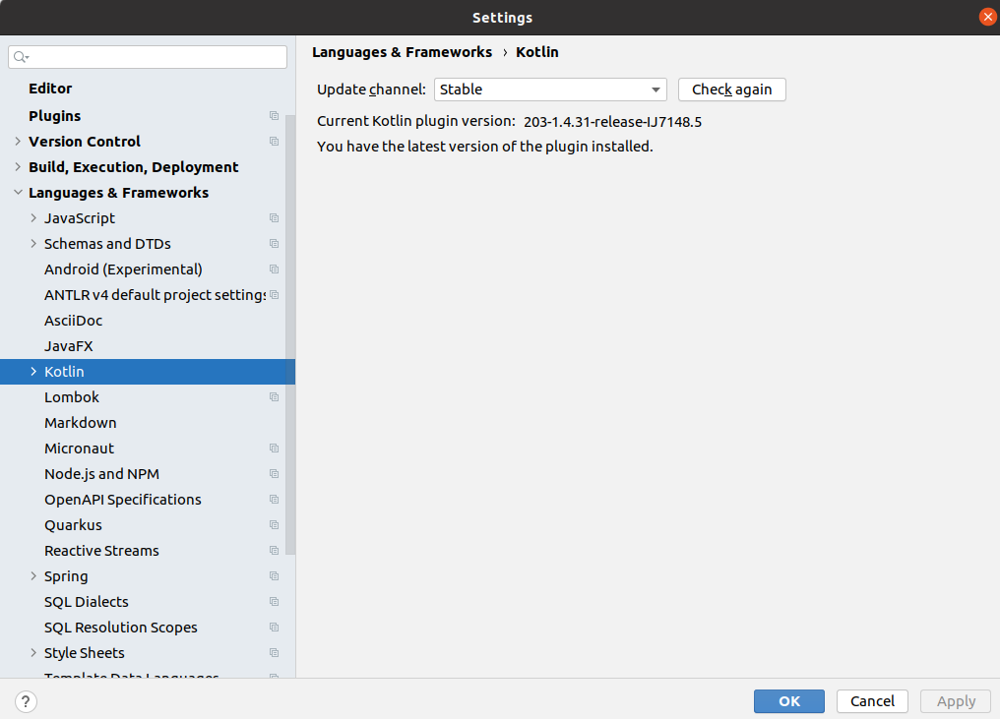

# Kotlin/Native and Multiplatform Workshop

**Javaland 2021, 17.03.20201, 17 Uhr**

Community activity workshop

Michal Harakal, Falk Sippach

## Set up the environment

* **Recommended**: Current version of IntelliJ IDEA (2020.3.x) 
* **or** Android Studio 4.2 with KMM plugin

NOTE: Also make sure that **Android SDK** has been installed.
**Android SDK** can be installed via menu item **Tools->Android->SDK Manager**

## Getting Started (with IntelliJ IDEA)

### Create project from template

1. Create new project from template via **File->New project ...**
2. From modules type select **Kotlin** and **Jetpack compose for Desktop (experimental)**

<h3 align="center">
  
</h3>

After succesfull import, you can compile Android App or JVM Desktop App with gradle tasks:

**:desktop:run**
or
**:android:assembleDebug**

## Getting Started (with Android Studio 4.1.2)

Requires **Kotlin 1.4.30+** and **macOS**

### Install KMM Plugin

<h3 align="center">
  
</h3>

### Create project from template

1. Create new project from template via **File->New project ...**
2. From Project Template select **KMM Application**

<h3 align="center">
  
</h3>

After succesfull import, you can compile Android App or JVM Desktop App with gradle tasks:

**:android:assembleDebug**

For details follow offcial KMM documentation: https://kotlinlang.org/docs/mobile/setup.html


## Update dependencies

### Update IntelliJ Gradle Kotlin Plugin
<h3 align="center">
  
</h3>


### Gradle plugins

- **org.jetbrains.compose:compose-gradle-plugin** = 0.3.2
- **com.android.tools.build:gradle** = 4.0.1
- **gradle-plugin** = 1.4.31
- **org.jetbrains.kotlin:kotlin-serialization** = 1.4.31
- **dev.icerock.moko:network-generator** = 0.11.0

### Libraries
State of 15.3.2021

1. Kotlin **1.4.31**
2. Jetpack Compose Desktop **0.3.2**
3. Kotlin Serialize   **1.1.0**
4. Ktor **1.5.2**
5. Kotlin couroutines 


## Dukecon DTO Model

1.Add **Moko-Network plugin**

root build.gradle.kts

```
buildscript {
    repositories {
        maven { url = "https://dl.bintray.com/icerockdev/plugins" }
    }

    dependencies {
        classpath "dev.icerock.moko:network-generator:0.12.0"
    }
}


allprojects {
    repositories {
        maven { url = "https://dl.bintray.com/icerockdev/moko" }
    }
}
```

project build.gradle.kts

```
apply plugin: "dev.icerock.mobile.multiplatform-network-generator"

dependencies {
    commonMainApi("dev.icerock.moko:network:0.12.0")
}
```

3.Add OpenAPI specification for Dukecon from Swagger(OpenApi) file

Download: https://github.com/michalharakal/kmp-workshop/blob/main/javaland2021/code/specs/conference_api.json

and save here: ./specs

### Dukecon OpenApi specification

project build.gradle.kts

```
mokoNetwork {
    spec("dukecon") {
        inputSpec = file("${rootDir}/specs/conference_api.json")
        packageName = "org.dukecon.api"
        isInternal = false
        isOpen = true
    }
}
```

After proper install a new task **dukeconOpenApiGenerate** will be added.


## DukeCon API 

1. Add ktor dependencies
2. Add support for serialization
3. Write wrapper


### Dukecon API JVM Unit test

```
package org.dukecon.common.api

import kotlinx.coroutines.runBlocking
import org.dukecon.api.DukeconApi
import org.junit.Test
import kotlin.test.assertTrue

class DukeconApiTest {
    @Test
    fun testJavaland() {
        val api = DukeconApi()
        runBlocking<Unit> {
            val events = api.getEvents()
            assertTrue { events.isNotEmpty() }
        }
    }
}
```

## Jitpack publishing

[](https://jitpack.io/#michalharakal/kmp-workshop)


