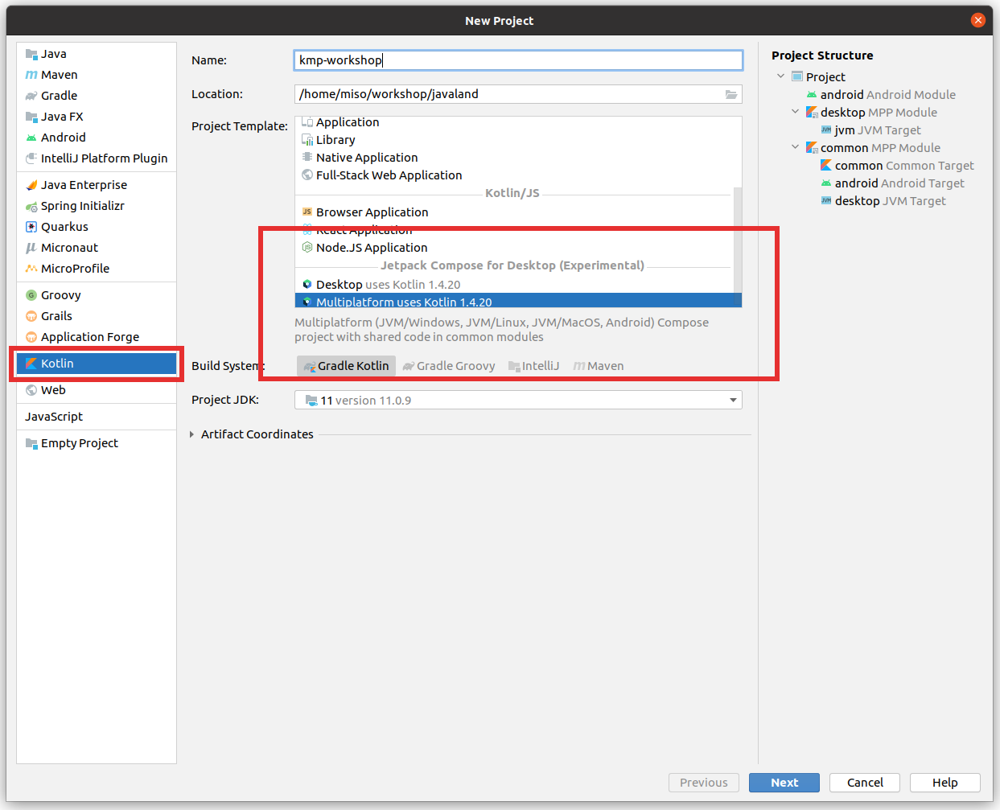
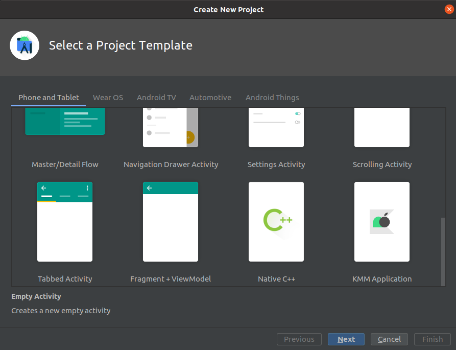

# Kotlin multiplatformworkshop

Javaland 2021, Cummunity effort

Falk Sippach, Michal Harakal


## Set up the environment

* Current version of IntelliJ IDEA(2020.3.1) 
* or Android Studio 4.2 with KMM plugin

NOTE: Also check that you Android SDK has been installed.

## Getting Started mit IntelliJ IDEA

### Create project from template

1. Create new project from template via **File->New project ...**
2. From modules type select **Kotlin** and **Jetpack compose for Desktop (experimental)**

<h3 align="center">
  
</h3>

After succesfull import, you can comppile Android App or JVM Desktop App with gradle tasks:

**:desktop:run**
**:android:assembleDebug**

## Getting Started mit Android Studio 4.1.2

Requires **Kotlin 1.4.30+** and **macOS**

### Install KMM Plugin

<h3 align="center">
  
</h3>

### Create project from template

1. Create new project from template via **File->New project ...**
2. From Project Template select **KMM Application**

<h3 align="center">
  
</h3>

After succesfull import, you can comppile Android App or JVM Desktop App with gradle tasks:

**:android:assembleDebug**

For details follow offcial KMM documentation https://kotlinlang.org/docs/mobile/setup.html

## Update current libraries

State of 15.3.2021

1. Kotlin **1.4.31**
2. Jetpack Compose Desktop **0.3.2**
3. Kotlin Serialize   **1.1.0**
4. Ktor **1.5.2**
5. Kotlin couroutines 

## Dukecon DTO Model

1.Add **Moko-Netwrok plugin**
2.Add OpenAPI specification for Dukecon from Swagger(OpenApi) file


### Dukecon OpenApi specification
```
mokoNetwork {
    spec("dukecon") {
        inputSpec = file("${rootDir}/specs/conference_api.json")
        packageName = "org.dukecon.api"
        isInternal = false
        isOpen = true
    }
}
```


## DukeCon API 

1. Add ktor dependencies
2. Add support for serialization
3. Write wrapper


### Dukecon API JVM Unit test

```
package org.dukecon.common.api

import kotlinx.coroutines.runBlocking
import org.dukecon.api.DukeconApi
import org.junit.Test
import kotlin.test.assertTrue

class DukeconApiTest {
    @Test
    fun testJavaland() {
        val api = DukeconApi()
        runBlocking<Unit> {
            val events = api.getEvents()
            assertTrue { events.isNotEmpty() }
        }
    }
}
```


