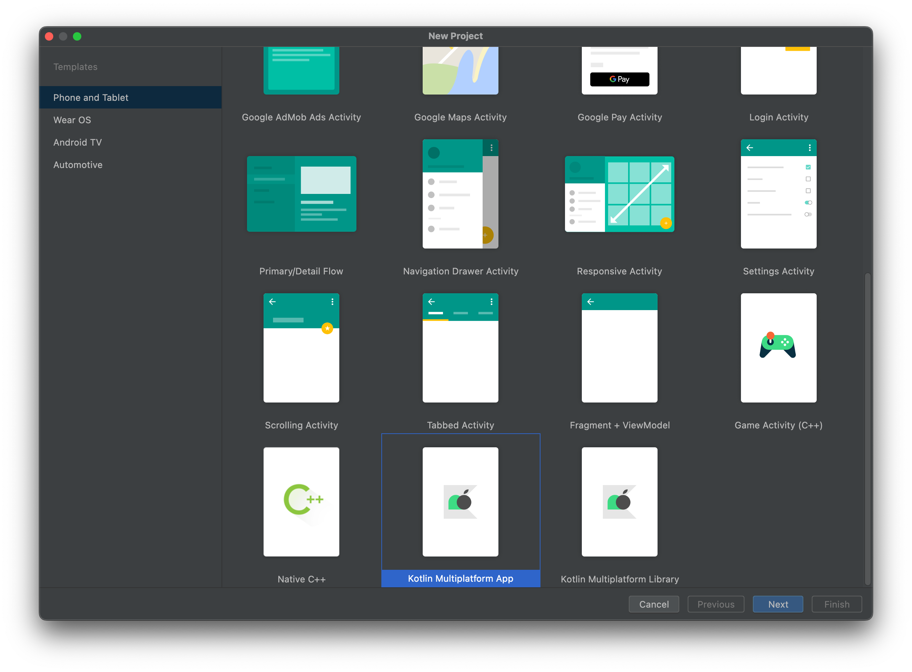
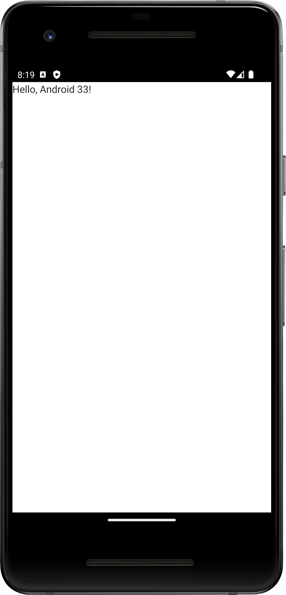

# Create your first app that works both on Android and iOS with the IDE

The goal of this codelab is to create a simple app that works on Android and iOS. We start by creating the app from the wizard. This step also makes sure, that working environment is set properly. See [setup](setup.md) section for details. 


## Create a new project

Start with a new project from the wizard. In case that KMM plugin is not installed, you can select 



Initially, it takes some time until projects imports and builds.

After the project is created, you can simply run it on Android or iOS simulator.

Lets have a look on the project structure.

### commonMain

```kotlin
expect fun getPlatform(): Platform
```


### androidMain

```kotlin
class AndroidPlatform : Platform {
    override val name: String = "Android ${android.os.Build.VERSION.SDK_INT}"
}

actual fun getPlatform(): Platform = AndroidPlatform()
```

### iosMain

```kotlin
import platform.UIKit.UIDevice

class IOSPlatform: Platform {
    override val name: String = UIDevice.currentDevice.systemName() + " " + UIDevice.currentDevice.systemVersion
}

actual fun getPlatform(): Platform = IOSPlatform()
```
!!! hint
IOS platform highlits the possibility to use platform specific libraries. In this case, we use `UIKit` framework to get information about the device.


## Result

### Android


### iOS


If you want check an expected results, checkout [codelab 1 Branch]((https://github.com/michalharakal/kmp-workshop/tree/javaland2023/codelab-1/javaland2023/codelab/iot-explorer)