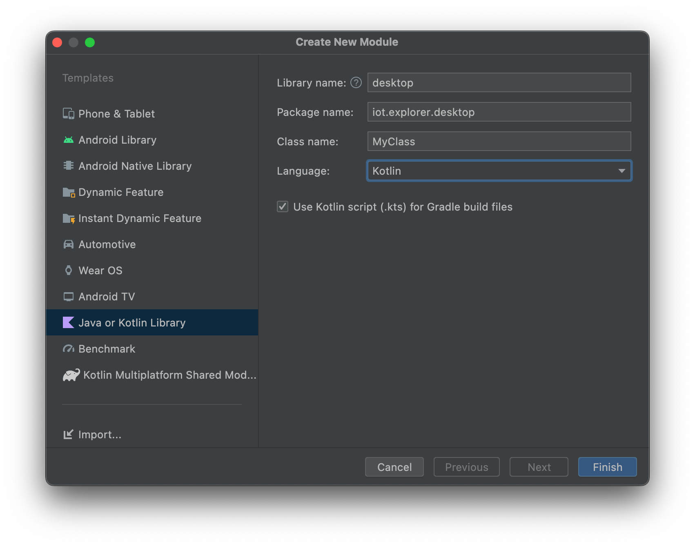
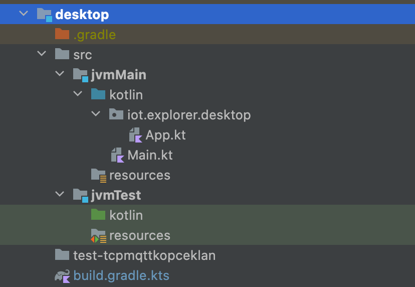
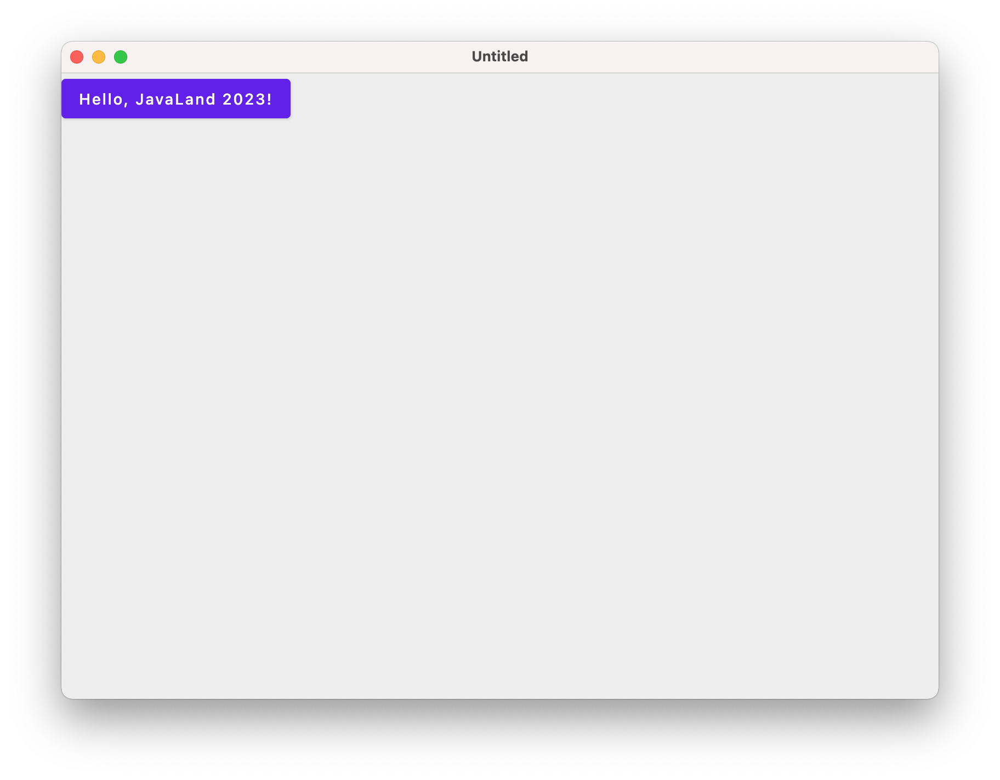

# Add a desktop app to your project

You can start directly here by cloning the results from previous
step [codelab 1 Branch](https://github.com/michalharakal/kmp-workshop/tree/javaland2023/codelab-1/javaland2023/codelab/iot-explorer)

## Adding a desktop app as a new module



## Fix gradle.build.kts


### Plugins
* use Kotlin Multiplatform plugin and plugin for Compose Multiplatform

```kotlin
plugins {
    kotlin("multiplatform")
    id("org.jetbrains.compose") version "1.3.0"
}
```


### Dependencies

* define *JVM* as one and only mutltiplatform target
* add dependencies for shared code
* add compose dependencies

```kotlin
kotlin {
    jvm {
        jvmToolchain(11)
        withJava()
    }
    sourceSets {
        val jvmMain by getting {
            dependencies {
                implementation(project(":shared"))
                implementation(compose.desktop.currentOs)
            }
        }
        val jvmTest by getting
    }
}
```

!!! note
Now we have a new source set `jvmMain` and `jvmTest` for JVM specific code.

Also adapt folder structure to match new source set.



!!! note
Add `kotlin.native.cacheKind=none` to `gradle.properties` to avoid caching issues with Compose Multiplatform 

## Result




If you want check an expected results,
checkout [codelab 2 Branch](https://github.com/michalharakal/kmp-workshop/tree/javaland2023/codelab-2/javaland2023/codelab/iot-explorer)