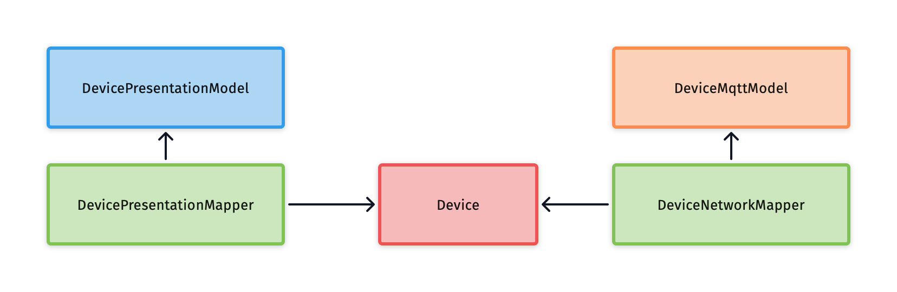

# Add business logic to your project

You can start directly here by cloning the results from previous
step [codelab 2 Branch](https://github.com/michalharakal/kmp-workshop/tree/javaland2023/codelab-2/javaland2023/codelab/iot-explorer)

## Notes on software architecture

Blocks in the image are grouped by columns into the following 3 layers:

* presentation
* domain
* data

## Additional dependencies

* Couroutines
* Android Lifecycle for handling in ViewModel

## Result

TBD

If you want check an expected results,
checkout [codelab 3 Branch](https://github.com/michalharakal/kmp-workshop/tree/javaland2023/codelab-3/javaland2023/codelab/iot-explorer)