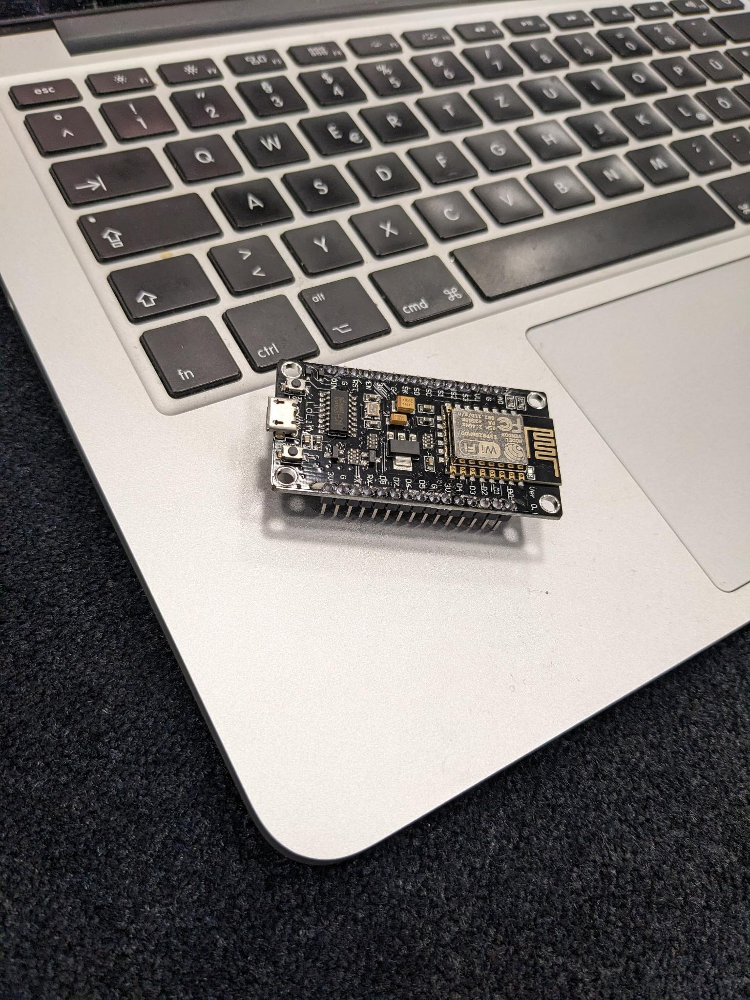
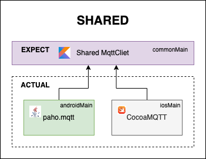

# Add a real device to your project

You can start directly here by cloning the results from previous
step [codelab 4 Branch](https://github.com/michalharakal/kmp-workshop/tree/javaland2023/codelab-4/javaland2023/codelab/iot-explorer)

## Goal

Finaly  are going to talk the real device. In this case it is a small ESP832 board with WiFi running light Mqtt broker. It could tells us for example a current temperature.




## Talking to the real world

Here we use again power of `expect/actual` and write KMP mqtt client using native libraries

### Add mqtt-client




### common

```kotlin
package iot.explorer.data

expect class MqttReceiver constructor() {
    fun connect(
        url: String = "tcp://192.168.3.156",
        onMessage: (String) -> Unit,
        onError: (String) -> Unit
    )
}
```

### Android

```kotlin
package iot.explorer.data

import org.eclipse.paho.client.mqttv3.IMqttDeliveryToken
import org.eclipse.paho.client.mqttv3.MqttCallback
import org.eclipse.paho.client.mqttv3.MqttClient
import org.eclipse.paho.client.mqttv3.MqttMessage
import org.eclipse.paho.client.mqttv3.persist.MemoryPersistence

actual class MqttReceiver actual constructor() {


    private lateinit var client: MqttClient

    // mqtt-client subscribe --host=mqtt.kopcek.lan --topic=/home/#
    actual fun connect(
        url: String,
        onMessage: (String) -> Unit,
        onError: (String) -> Unit
    ) {
        val persistence =  MemoryPersistence()
        client = MqttClient(url, "test", persistence)
        client.connect()
        client.subscribe("/home/#")
        client.setCallback(object : MqttCallback {
            override fun messageArrived(topic: String?, message: MqttMessage?) {
                try {
                    onMessage(message.toString())
                } catch (e: Exception) {
                    e.printStackTrace()
                }
            }

            override fun connectionLost(cause: Throwable?) {
            }

            override fun deliveryComplete(token: IMqttDeliveryToken?) {
            }
        })
    }

    fun disconnect() {
        client.disconnect()
    }

}
```
### Add Android Dependencies

```kotlin
       val androidMain by getting {
            dependencies {
                api("androidx.appcompat:appcompat:1.6.1")
                api("androidx.core:core-ktx:1.9.0")
                api("androidx.lifecycle:lifecycle-runtime-compose:2.6.0")
                api("androidx.lifecycle:lifecycle-runtime-ktx:2.6.0")
                api("androidx.lifecycle:lifecycle-viewmodel-ktx:2.6.0")
                implementation("org.eclipse.paho:org.eclipse.paho.client.mqttv3:1.2.5")
            }
        }
```
As you can see, we use eclipse's paho library for mqtt communication, show real power of Kotlin Multiplatform.

### iOS

For iOS we use [CocoaMQTT](https://github.com/emqx/CocoaMQTT/), which has a known issue with `cinterop` with swift libraries using `@import` directive usages in a generated Obj-C header 
The fix for the issue is tracked with this [Github issue](https://github.com/michalharakal/kmp-workshop/issues/3)

Of course, you can always add this CocoaPod dependency into the iOS project directly, and then calling `shared` code from iOS project.

## Result

Voilà, now we have a real device connected to our app.

If you want check an expected results, checkout [codelab 5 Branch](https://github.com/michalharakal/kmp-workshop/tree/javaland2023/codelab-5/javaland2023/codelab/iot-explorer)