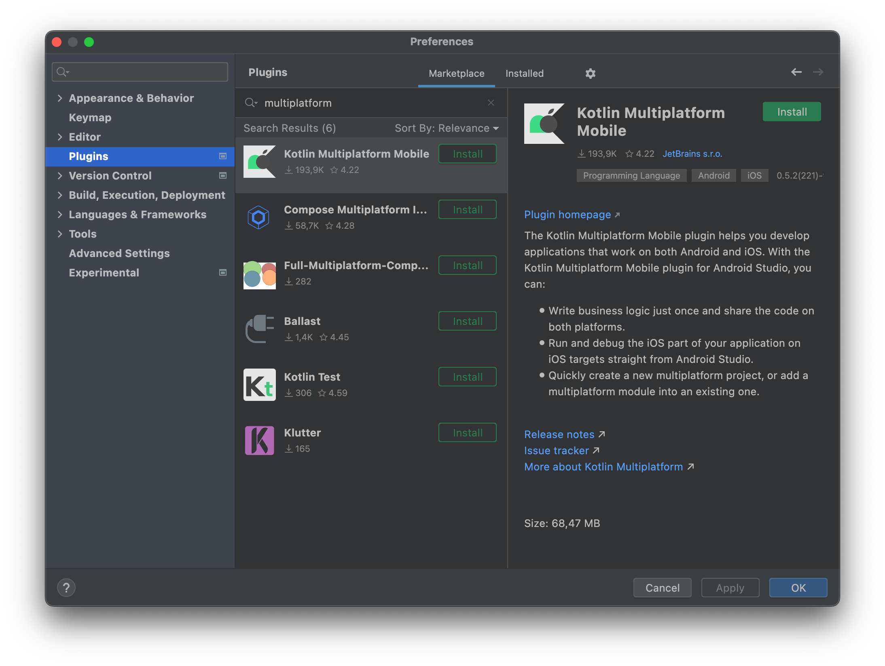
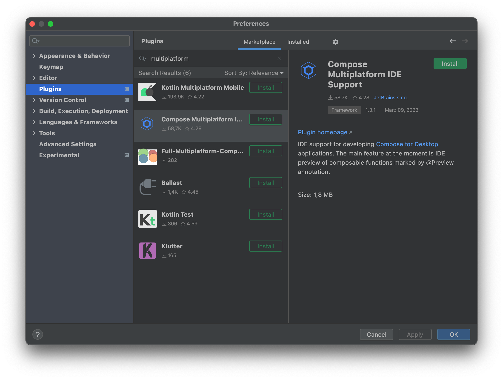

#  Set up an environment

##  Prerequisites

!!! note
To write iOS-specific or macOS-specific code  and run it as a native iOS or macOS application on a simulated or real device, you'll need a Mac with macOS. This cannot be performed on other operating systems, such as Microsoft Windows. This is an Apple requirement.

##  Install the required software

### Android Studio

* **Recommended**: Current version of Android Studio
  * Android Studio Electric Eel | 2022.1.1 Patch 2 (as for **17.3.2023**)
* IntelliJ Plugin [Kotlin Multiplatform Mobile](https://plugins.jetbrains.com/plugin/14936-kotlin-multiplatform-mobile)
* IntelliJ Plugin [Compose Multiplatform IDE Support](https://plugins.jetbrains.com/plugin/16541-compose-multiplatform-ide-support)

#### KMM Plugin

#### Compose Multiplatform IDE Support

!!! note
Also make sure that **Android SDK** has been installed.
**Android SDK** can be installed via menu item **Tools->Android->SDK Manager**

### IntelliJ IDEA

!!! warning
Current version of IntelliJ IDEA will work probably as well, but is **not tested yet** with this workshop.

!!! hint
If you want just try out Compose Multiplatform just with Desktop JVM on IntelliJ IDEA, you can simply follow official guide [Guide for getting started with Compose Multiplatform](https://github.com/JetBrains/compose-multiplatform/tree/master/tutorials/Getting_Started)

## iOS and macOS

Xcode 14 or later is required to develop for iOS. A (free) Apple Developer account is required to deploy onto a device.
We recommend to install the [TouchLab Kotlin Plugin for Xcode](https://github.com/touchlab/xcode-kotlin) by running: `brew install xcode-kotlin`

